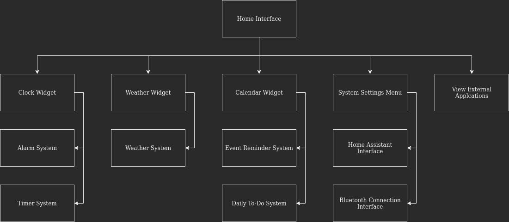

# Magic Mirror Overall Design

## Part 1: Introduction
Magic Mirror is a software program designed for everyday day users as a daily use tool. 
Several tools and widgets will be available for the user to select, choose and modify the overall layout.
Tools/widgets will include:

- Live weather display
- Calendar of the user and upcoming events
- See the time and set alarms
- Interact with home assistant devices such as Google Home or Amazon Alexa
- Wireless pairing with external devices to play audio
- Open other web applications within the program such as Instagram, Facebook and YouTube

## Part 2: Guidelines
Magic Mirror will be developed predominantly using OpenJDK 18 in Intellij IDE. The UI will be constructed
with Java Swing and the AWT (Abstract Window Toolkit) package. This project will follow the MVC
(Model, View, Control) design pattern. For locally saved data, a local webserver will be created using 
Spring Boot. 

## Part 3: System Architecture Diagrams
Holistic System Diagram: The following diagram shows a high-level view of the software

